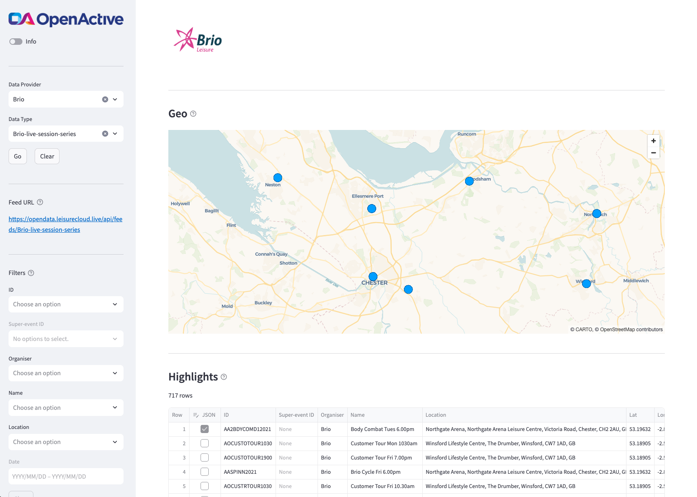

This Streamlit app is an example tool for familiarising all users with OpenActive data, and for helping Python users to get better acquainted with the OpenActive Python library ([GitHub](https://github.com/openactive/openactive-python), [PyPI](https://pypi.org/project/openactive/), [Conda-Forge](https://anaconda.org/conda-forge/openactive)). It allows a user to select and read an OpenActive feed, and displays summary output in a map (if geo data are available), a table, and JSON. Filters are also included to select items based on ID, organiser, name, location and date.

